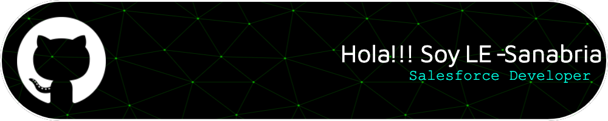

<!--_________________________________________________________________________________________________________________________________________________________________________________________
</br>
<div align="center">
  
  
  
  
  
  
  
  
  
</div>
</br>

_________________________________________________________________________________________________________________________
</br>
<div align="left">
  
  
  
</div>
</br>-->

<!--###


###-->

_____________________________________________________________________________________________________________________________________________________________________________________________________________


<!--

```javascript
Coffee coffee = new Coffee();
if(coffee.Empty){
  coffee.Refill();
} else{
  coffee.Drink();
}
```
-->


# 💫 About Me:
Actually I'm a Salesforce Consultant/Developer<br>This is my personal repository with solution and ideas that may be will need on the future or maybe never. Who knows <br>May the force be with us!!!


# 💻 Tech Stack:
      
# 📊 GitHub Stats:
<br/>
<br/>


## 🏆 GitHub Trophies


### ✍️ Random Dev Quote


### 🔝 Top Contributed Repo


---
[](https://visitcount.itsvg.in)

<!-- Proudly created with GPRM ( https://gprm.itsvg.in ) -->
V3.0.0
